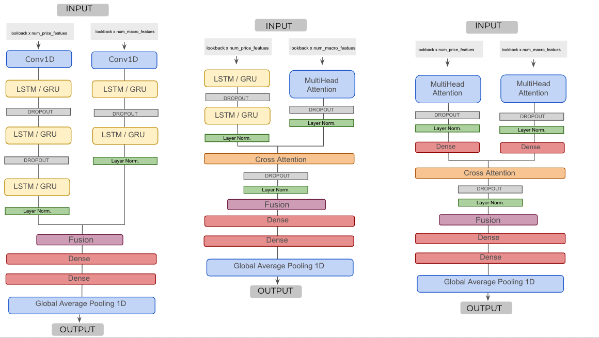

#  Commodities Forecasting with Neural Networks

This repository contains the full implementation of my Master's thesis:  
**"Forecasting Commodity Markets Using Neural Networks: A Quantitative Study Using Engineered Inputs and Deep Learning Architectures."**

The project explores the use of deep learning architectures—including LSTM, GRU, Transformer-based models, and hybrid variants—for **1-day ahead forecasting** of major commodities: **Gold**, **Silver**, and **Copper**.


##  Key Contributions

-  **Custom Feature Engineering**: Created from raw market data and enriched with macroeconomic and geopolitical indicators
-  **Dual-Input Model Design**: Combines sequential price data with static macro/sentiment features across multiple architectures
-  Evaluates a **wide variety of architectures**, including Transformer-based models (Autoformer, Informer, PatchTST, TimesNet), recurrent networks (LSTM, GRU), and hybrid variants (e.g., TFT+GRU)
-  Walk-forward validation for robust out-of-sample performance
-  Comprehensive evaluation using RMSE, MAE, and Directional Accuracy


##  Feature Categories

###  Market-Based Features
Derived directly from daily OHLCV data and include a range of technical indicators, trend signals, and return-based calculations.

###  Macroeconomic Indicators
Selected variables from the Federal Reserve Economic Database (FRED) such as interest rates, CPI, unemployment, GDP, and monetary aggregates.

###  External Financial & Geopolitical Indicators
Market indices, volatility measures, and geopolitical risk indicators sourced from Yahoo Finance and the Geopolitical Risk Index (GPR).

##  Models Implemented

- **Recurrent Architectures**: LSTM, GRU (dual-input designs)
- **Transformer-Based Models**: Autoformer, Informer, PatchTST, TimesNet
- **Hybrid Architectures**: TFT + LSTM/GRU, Pure Transformers (dual-input designs)
- **Other Deep Learning Models**: NHITS (hierarchical CNN-based forecasting model)
- **Benchmark Models**: SVR, XGBoost, Random Forest
- 
## Architectures



##  Evaluation Metrics

- **Root Mean Squared Error (RMSE)**
- **Mean Absolute Error (MAE)**
- **Directional Accuracy (DA)**:

All models are evaluated using **walk-forward validation** across two time horizons(1 day and 7 days) and commodities.


```
Commodities-Forecast-NN/
├── config/ # Configuration JSONs for each model
│ ├── con_gru.json
│ ├── con_lstm.json
│ ├── con_tft_gru.json
│ ├── con_tft_lstm.json
│ ├── con_transformers.json
│ ├── ben_rf.json
│ ├── ben_xgb.json
│ └── ben_svr.json
├── data/ #Commodities
├── notebooks/ # Jupyter notebooks (EDA etc.)
├── output/ # Generated metrics and plots
├── src/
│ ├── architectures/ # All models
│ │ ├── tf_stacked_gru.py
│ │ ├── tf_stacked_lstm.py
│ │ ├── tf_tft_gru.py
│ │ ├── tf_tft_lstm.py
│ │ ├── tf_transformers.py
│ │ └── benchmarks.py
│ └── train_tf.py # Training script
├── main.py # 
└── requirements.txt # Dependencies
```

##  Running the Repository


### 1. Install Dependencies

Before running any model, make sure to install all required Python packages:

```bash
pip install -r requirements.txt


